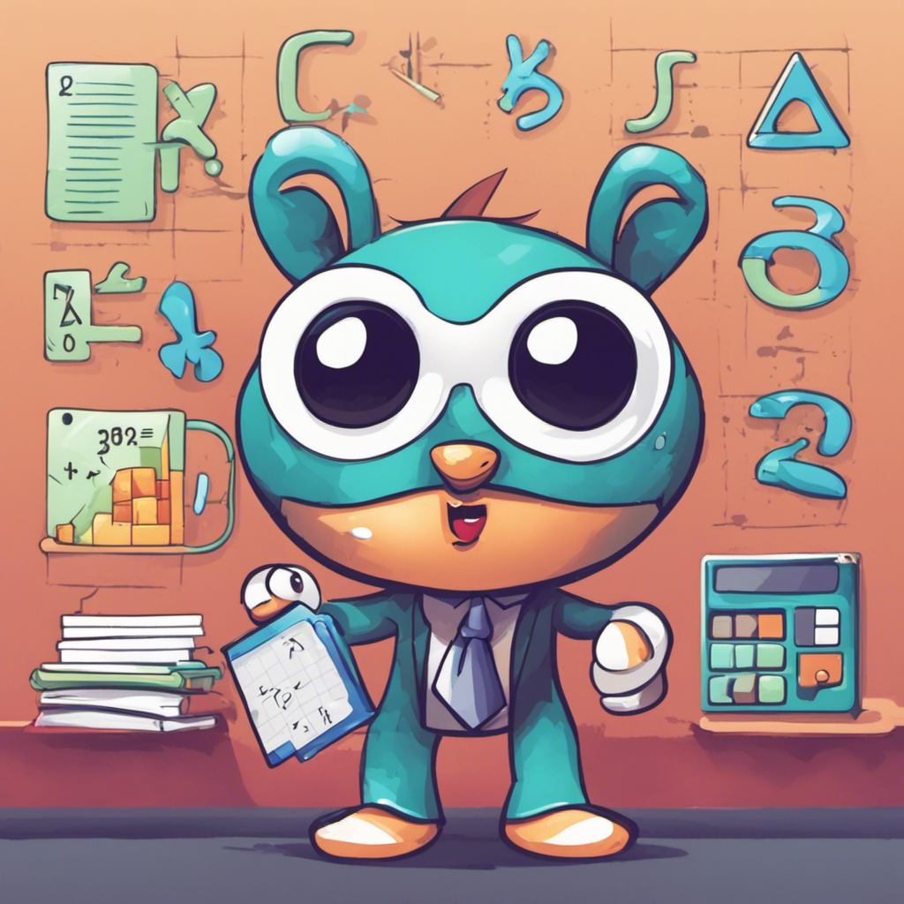

<h1>Dataman The Game</h1>

<h2>Description of the game and it's benefits</h2> 
<body>
 

This educational initiative is meticulously designed to seamlessly blend entertainment with learning, with the primary objective of enhancing children's proficiency in mathematics and fostering critical thinking skills. Through the integration of a dynamic math quiz and an immersive guessing game focusing on numbers from 1 to 20, the program serves a diverse set of purposes:

The math quiz segment acts as a tool for reinforcing fundamental mathematical concepts, prompting children to tackle challenges that strengthen their arithmetic skills and deepen their understanding of mathematical principles. Concurrently, the guessing game facet catalyzes the development of critical thinking and deductive reasoning. Children actively engage in strategic guessing, refining their logical thought processes and cultivating essential problem-solving abilities.

The program ensures an interactive and enjoyable learning environment, capturing children's interest by seamlessly blending educational content with playful elements. This approach guarantees that children remain engaged and motivated throughout their educational journey. Through adaptive learning mechanisms, the program tailors challenges to accommodate varying skill levels. As children progress, the difficulty levels dynamically adjust, providing an optimal learning curve for continuous skill enhancement. The combination of mathematical challenges and the strategic aspects of the guessing game places a premium on concentration and attention to detail. This emphasis cultivates focus—an indispensable skill that extends beyond the confines of the game into various aspects of children's lives. Moreover, the program goes beyond theoretical learning by integrating math concepts and logical thinking into a game scenario. This practical application vividly demonstrates the real-world relevance of acquired skills, emphasizing their significance beyond the traditional boundaries of a classroom setting.

</body>

<h3>Mascot</h3>

</img>

Meet Quizzy the Math-Loving Mouse

Quizzy is a bright blue mouse who lives in a hole in the wall of Mr. Matherson's math classroom. All day long, Quizzy listens as Mr. Matherson teaches the students about numbers, shapes, addition, subtraction, and more. The little mouse loves math and soaks up all the knowledge.

At night, when the classroom is empty, Quizzy sneaks out to practice math problems herself using worksheets and textbooks left on the desks. She gets so excited when she solves an equation correctly! "Squeak! I did it!" Quizzy cheers.

One day, Quizzy decides she wants to help the students with their math skills. She creates a fun educational math app just for Mr. Matherson's class. The app has games testing addition, subtraction, multiplication, division, fractions, and more.

As students play Quizzy's games, they can also dress up her avatar with math-themed accessories like ruler glasses, protractor bowties, and geometry-patterned outfits. Quizzy makes learning math fun!

Quizzy also adds typing games to her app to help improve the students' keyboarding skills for math problems. The faster they can type, the more points they earn to customize Quizzy!

Now whenever it's time for math class, the students can't wait to join their friend Quizzy the mouse in practicing their math and typing skills. Quizzy loves being the classroom math whiz!

here the code: [Math Quiz on GitHub](https://github.com/Ysjack/Ysjack.github.io/blob/main/math%20quiz#L1)
here the code: [Guessing Game on GitHub]([https://ysjack.github.io/guessing-game.io/](https://ysjack.github.io/guessing-game.io/
)https://ysjack.github.io/guessing-game.io/
)
